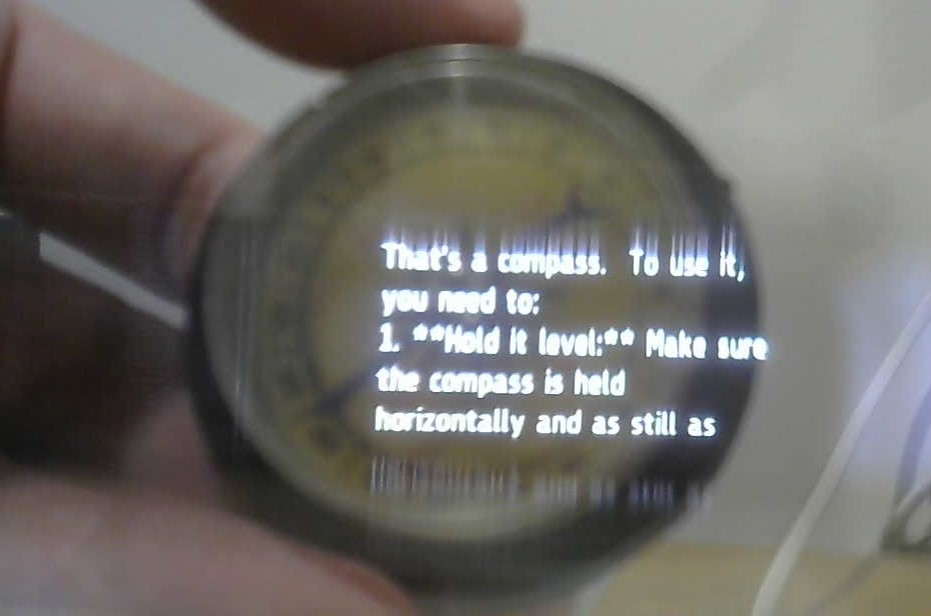
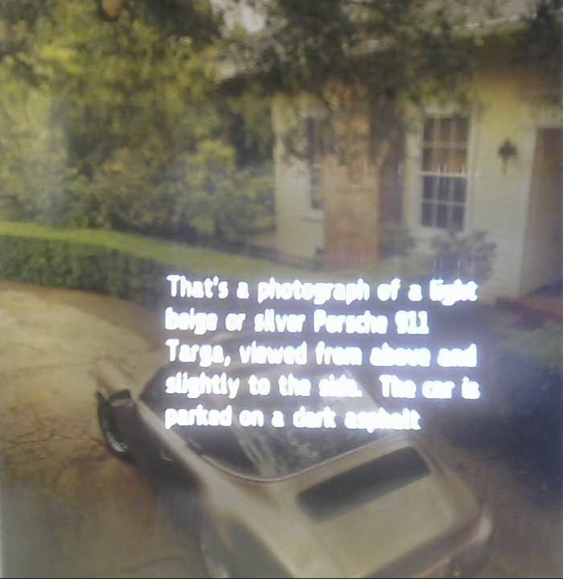
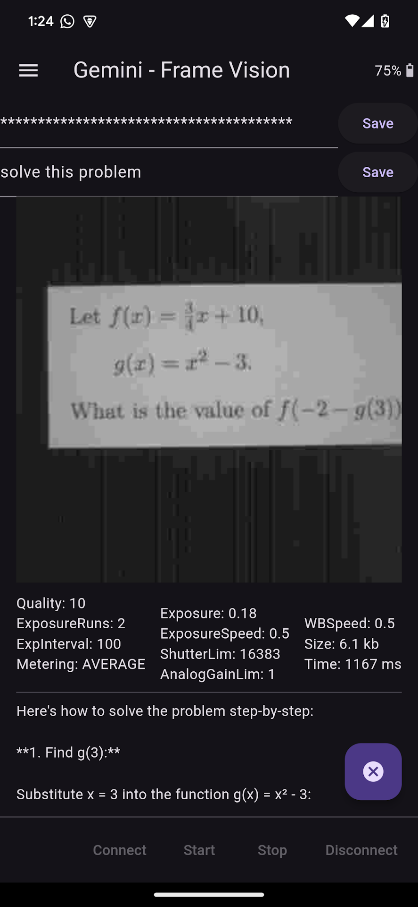
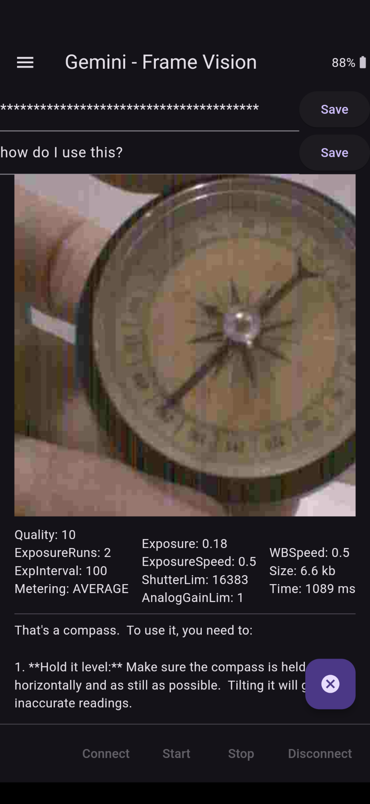
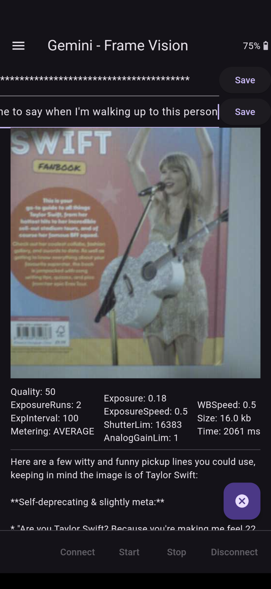
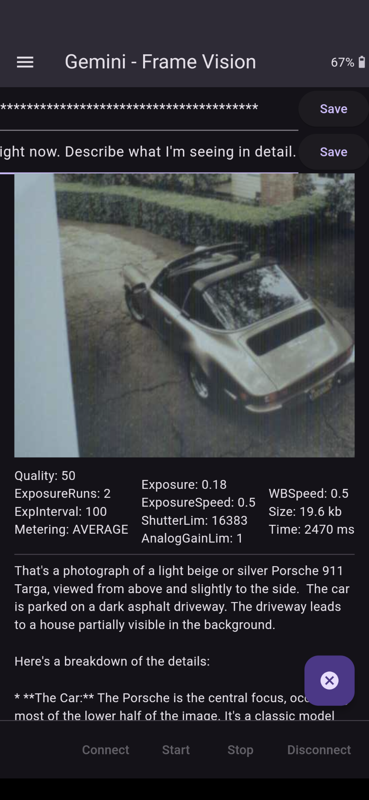

# Frame Vision: Gemini

Queries Google Gemini with a photo taken from Brilliant Labs Frame and a user-editable text prompt

### Frameshots

### Framecast

https://github.com/user-attachments/assets/d8acc149-da1d-4b62-899a-d63548c6a2aa

### Screenshots

